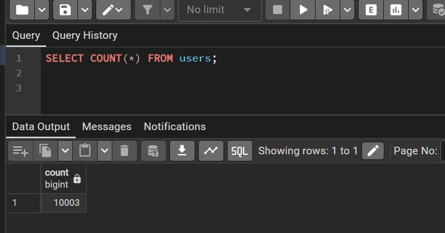
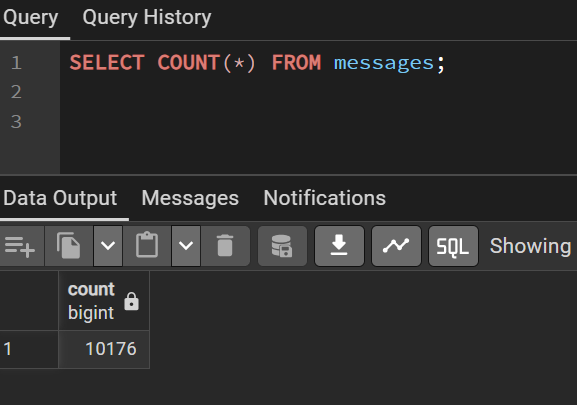
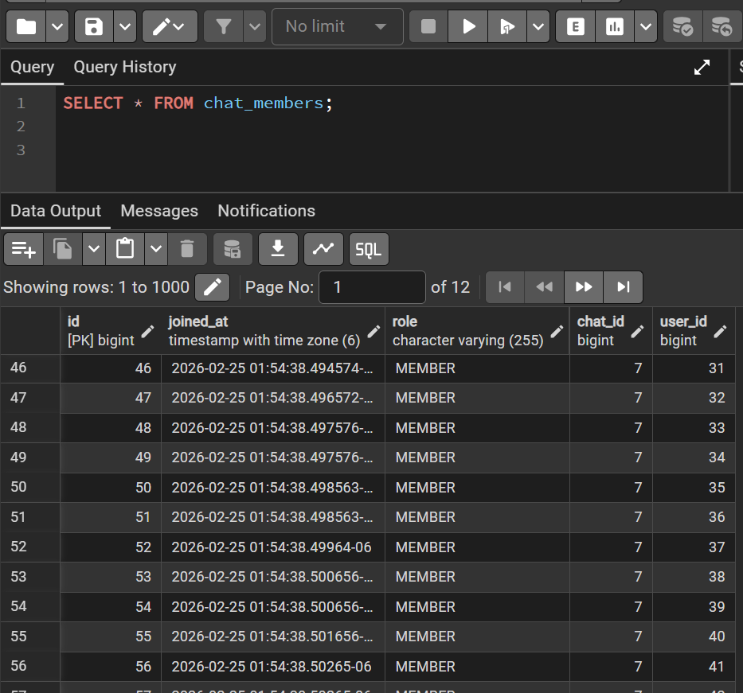

# 🚀 Real-Time Chat Application (Distributed & Scalable)

A production-style real-time chat system built with:

-   **Backend:** Java (Spring Boot)
-   **Frontend:** React (Vite)
-   **Database:** PostgreSQL
-   **Cache / Broker:** Redis
-   **Realtime Protocol:** WebSockets (STOMP over SockJS)
-   **Authentication:** JWT (Stateless)

This project demonstrates distributed systems thinking, real-time
messaging, authentication, concurrency handling, and horizontal
scalability.

------------------------------------------------------------------------

# 🧠 Architecture Overview

Client (React) ↓ Spring Boot REST API + WebSocket ↓ PostgreSQL
(Persistence) ↓ Redis (Pub/Sub for distributed messaging)

------------------------------------------------------------------------

# ✨ Features

## 🔐 Authentication

-   User Registration
-   User Login
-   JWT-based stateless authentication
-   Secure WebSocket authentication

## 💬 Chat System

-   Direct Chats
-   Group Chats
-   Chat Membership Enforcement
-   Message Persistence

## 📡 Real-Time Features

-   WebSocket Messaging
-   Typing Indicators
-   Online Presence Tracking
-   Read Receipts (SENT → DELIVERED → READ)

## ⚙️ Scalability

-   Redis Pub/Sub for horizontal scaling
-   Thread-safe Presence Service
-   Indexed DB queries for message retrieval
-   Load tested with 1000 concurrent users

------------------------------------------------------------------------

# 🗂 Project Structure

```
backend/
├── controller/
├── service/
├── repository/
├── model/
├── config/
├── security/
└── ChatApplication.java

frontend/
├── src/
│ ├── api/
│ ├── components/
│ ├── socket.js
│ └── App.jsx
```

------------------------------------------------------------------------

# 🛠 Tech Stack

Backend: Spring Boot\
Auth: JWT\
Database: PostgreSQL\
Cache: Redis\
Realtime: WebSocket (STOMP)\
Frontend: React + Vite\
Load Testing: Node.js

------------------------------------------------------------------------

# ⚡ Setup Instructions

## 1️⃣ Prerequisites

-   Java 17+
-   Node.js 18+
-   PostgreSQL
-   Redis

## 2️⃣ Backend Setup

Create database:

CREATE DATABASE chat_app;

Configure application.yml with your DB + Redis credentials.

Run backend:

mvn spring-boot:run

## 3️⃣ Frontend Setup

cd frontend\
npm install\
npm run dev

Frontend runs at:

http://localhost:5173

------------------------------------------------------------------------

# 🔬 Load Testing (10000 Users)

Install dependencies:

npm install axios @stomp/stompjs sockjs-client

Run:

node load-10000-users.js



Simulates: - 10000 unique users - JWT authentication - WebSocket
connections - Randomized message traffic

------------------------------------------------------------------------

# 🧠 What This Project Demonstrates

-   Real-time system design
-   Stateless authentication architecture
-   Distributed message propagation
-   Horizontal scalability
-   Concurrency-safe services
-   Backend performance testing mindset

------------------------------------------------------------------------

# 🚀 Future Improvements

-   Per-user read receipts
-   Message pagination
-   Rate limiting
-   Kafka integration
-   Kubernetes deployment
-   Metrics (Prometheus + Grafana)

------------------------------------------------------------------------

# 📄 License

MIT License
