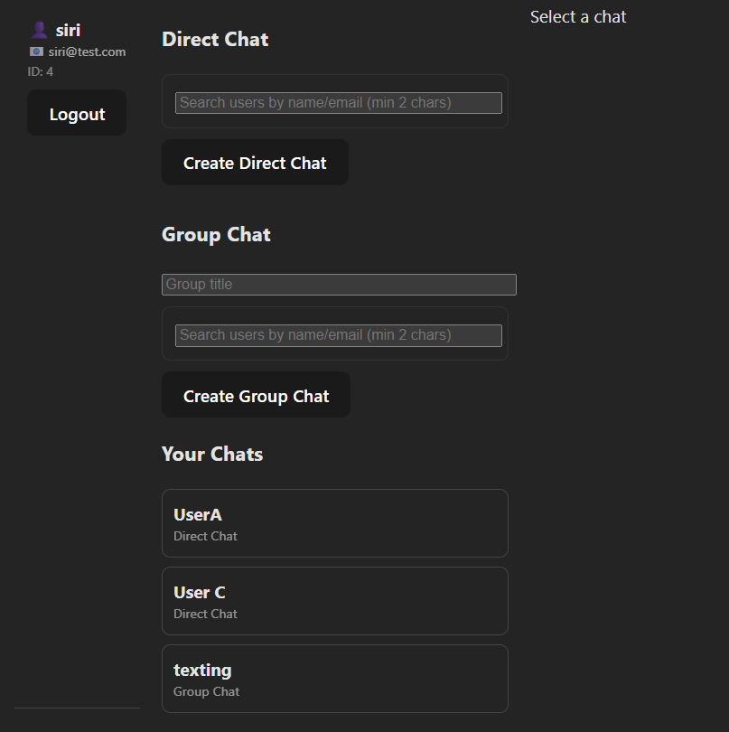

# 💬 Real-Time Chat Application -- Scalable Messaging Platform (Frontend)

This is a production-grade real-time chat frontend built using **React +
Vite**, designed to integrate with a **Spring Boot + PostgreSQL +
Redis** backend.

This project demonstrates:

-   Real-time WebSocket messaging (STOMP)
-   JWT-based authentication
-   Scalable frontend architecture
-   Direct and group chat support
-   Presence tracking (online/offline)
-   Read receipts & typing indicators
-   Clean API abstraction layer
-   Production-ready environment configuration

> This is not a demo chat UI.\
> It is designed as a distributed real-time messaging system.

------------------------------------------------------------------------

# 🚀 Executive Summary

This application enables users to:

-   Register and authenticate securely
-   Create direct and group chats
-   Send and receive messages in real time
-   View chat history
-   Monitor typing indicators
-   Scale up to thousands of concurrent users

The frontend is stateless and communicates with a secure backend using:

-   REST APIs (Axios)
-   WebSockets (STOMP over SockJS)
-   JWT-based authentication

------------------------------------------------------------------------

# 🧱 System Architecture

Client → REST (Axios) → Spring Boot\
Client → WebSocket (STOMP) → Spring Boot → Redis → Broadcast

------------------------------------------------------------------------

# 🧠 Frontend Architecture
```
src/
│
├── api/
│ ├── auth.js
│ ├── chats.js
│
├── components/
│ ├── Login.jsx
│ ├── ChatList.jsx
│ ├── ChatWindow.jsx
│
├── socket.js
├── App.jsx
└── main.jsx
```
------------------------------------------------------------------------

## 🔐 Authentication Flow

1.  User logs in
2.  Backend returns JWT
3.  Token stored in localStorage
4.  Axios attaches: Authorization: Bearer `<token>`{=html}
5.  WebSocket connects using token header
6.  Expired token triggers logout

------------------------------------------------------------------------

# 📦 Installation

## Prerequisites

-   Node.js v16+
-   npm or yarn
-   Backend API running

## Setup

git clone https://github.com/`<your-username>`{=html}/chat-frontend.git\
cd chat-frontend\
npm install

Create .env:

VITE_API_BASE_URL=http://localhost:8080\
VITE_WS_URL=http://localhost:8080/ws

Run:

npm run dev

Access:

http://localhost:5173


------------------------------------------------------------------------

# 🔗 Required Backend Endpoints

POST /auth/register\
POST /auth/login\
GET /api/chats\
POST /api/chats/direct\
POST /api/chats/group\
GET /api/chats/{id}/messages\
POST /api/chats/{id}/read

WebSocket Endpoint:\
/ws

------------------------------------------------------------------------

# ⚙️ Production Considerations

## Security

-   JWT-based authentication
-   Protected routes
-   No sensitive logic in frontend
-   Environment-based API configuration

## Performance

-   Efficient state updates
-   Optimized re-rendering
-   Controlled WebSocket lifecycle
-   Batched UI updates

## Scalability

-   Redis pub/sub supports multi-instance broadcasting
-   Backend handles horizontal scaling
-   Frontend remains stateless

------------------------------------------------------------------------

# 🧪 Testing Strategy

Refer: https://github.com/siri-chandanak/chatApp

Manual Testing:

-   Register two users
-   Create direct chat
-   Send messages between users
-   Verify presence indicators
-   Validate unread badge

Load Testing:

-   1000 concurrent WebSocket users
-   Batched ramp-up
-   Broadcast stress test

------------------------------------------------------------------------

# 🚀 Deployment Strategy

Frontend:

-   Vercel
-   Netlify
-   Nginx static hosting

Backend:

-   Docker container
-   AWS EC2
-   Kubernetes
-   Redis cluster

------------------------------------------------------------------------

# 👨‍💻 Author

Built as a distributed real-time messaging system using:

-   React + Vite
-   Spring Boot
-   PostgreSQL
-   Redis
-   WebSockets (STOMP)
-   JWT Security
